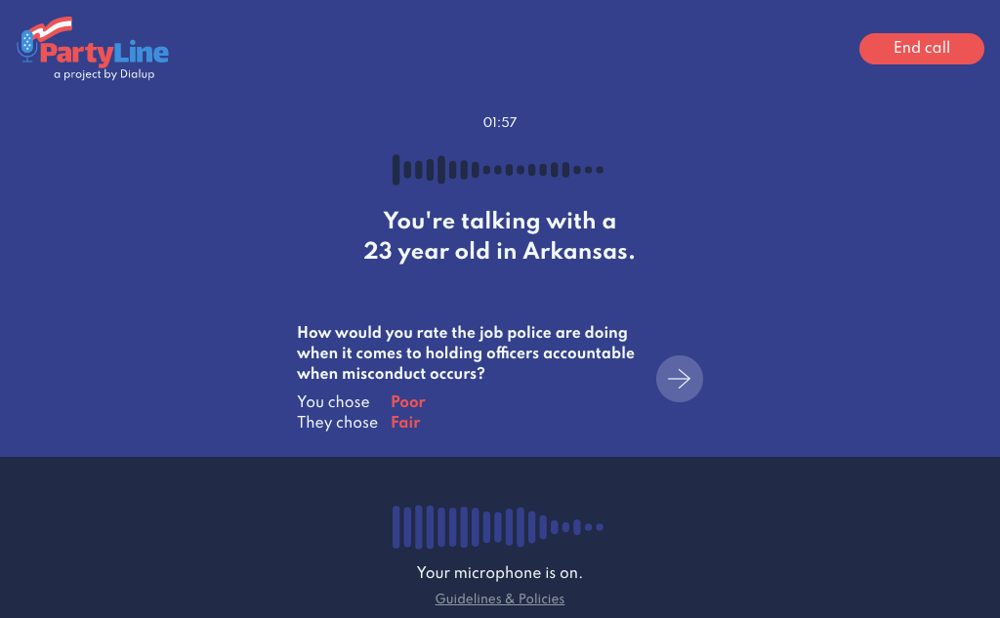
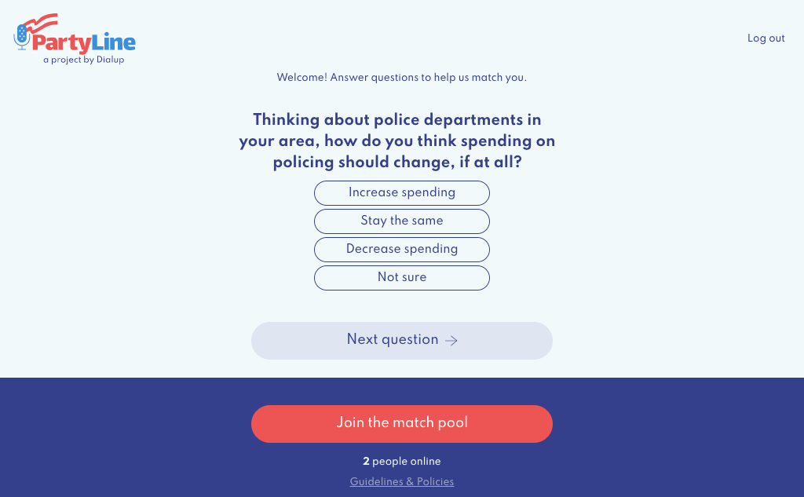
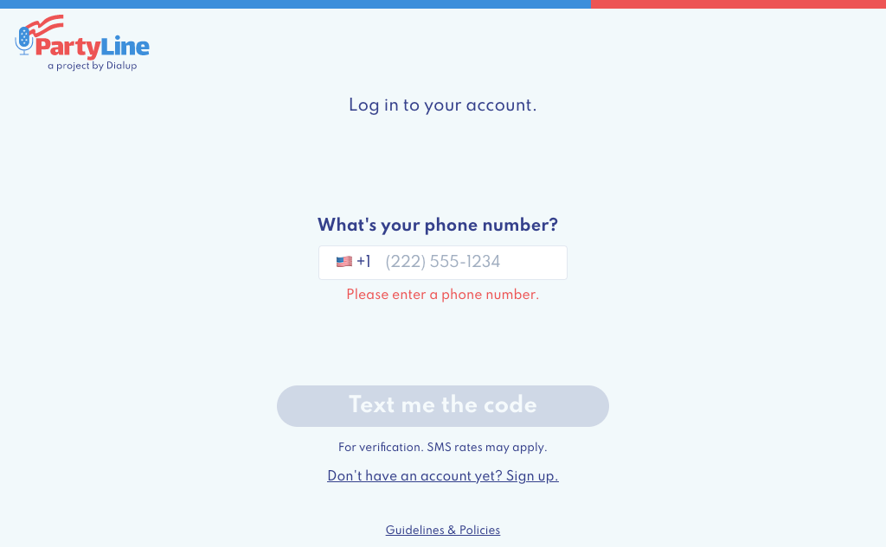

# PartyLine

PartyLine was a 2020 US Election social experiment designed by [Danielle Baskin](https://daniellebaskin.com) and programmed by [Max Hawkins](https://maxhawkins.me) and [Max Goodhart](https://chromakode.com).

PartyLine paired you in a voice-chat with someone in any state to have a conversation about political topics. Your match was determined by questions you answered: we matched people with different viewpoints together. You could match with someone in a city you've never been to before, someone with a completely different background than yours, or someone with a story that taught you something new.

This repository contains the web frontend, built with React, WebRTC, [Chakra UI](https://chakra-ui.com), and [XState](https://xstate.js.org).

## Screenshots

### In a call

### Before searching for a conversation

### Signing in

